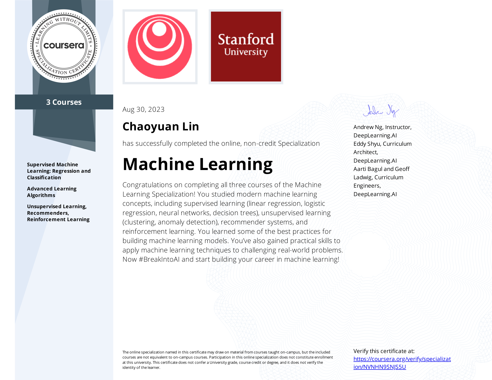
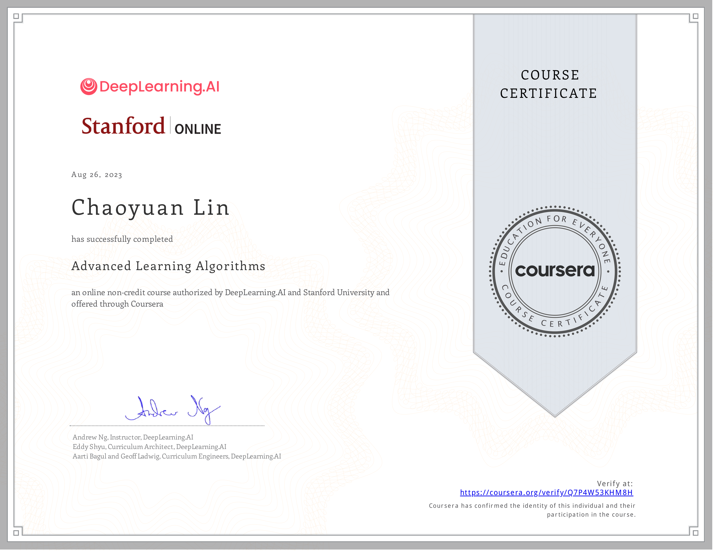
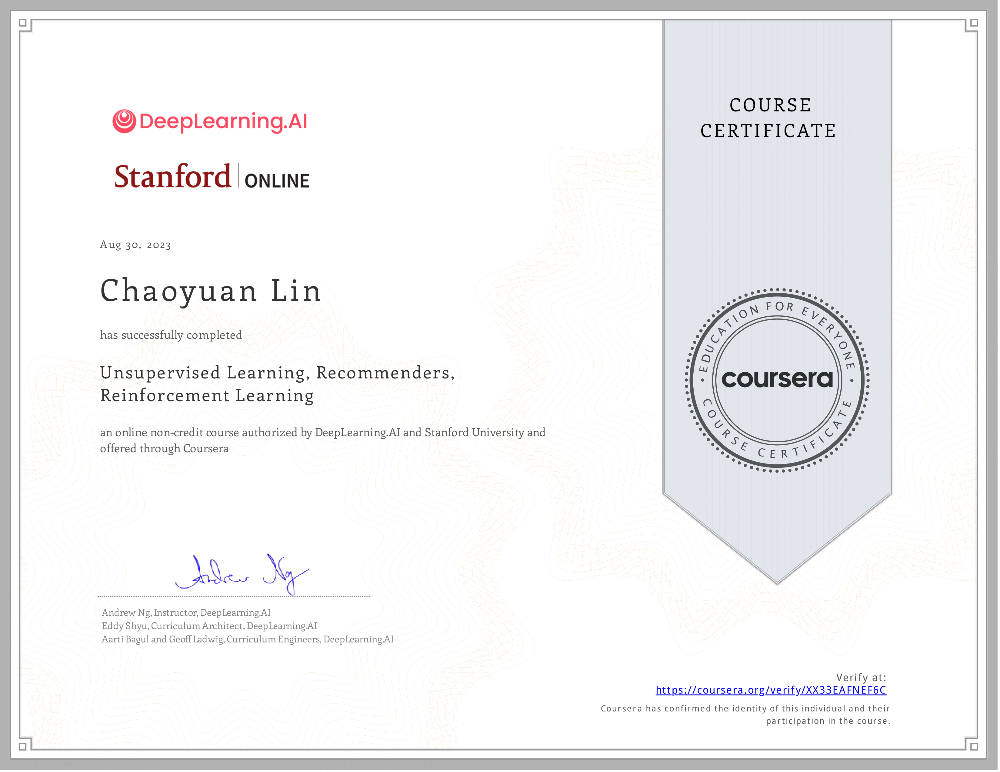

# Machine Learning(Coursera)

## Description:

> This course provides a broad introduction to modern machine learning, including supervised learning (multiple linear regression, logistic regression, neural networks, and decision trees), unsupervised learning (clustering, dimensionality reduction, recommender systems), and some of the best practices used in Silicon Valley for artificial intelligence and machine learning innovation (evaluating and tuning models, taking a data-centric approach to improving performance, and more.)

## Course Overview:

### Week 1: Introduction to Machine Learning

> In the first week of the course, it starts by introducing different types of machine learning(supervised VS unsupervised) that people use in different situation. In addition, this week teaches the very basic linear regression algorithm(cost function, learning rate and gradient descent).

### Week 2: Regression with multiple input variables

> In the second week of the course, it dives deeper into Linear Regression with multiple input variables by introducing using numpy array to efficiently do the dot product between them and Gradient Descent with multiple input variables. Moreover, it introduces Polynomial Regression Learning and feature engineering to fit curves with non-linear functions to the data.

Assignment: [here](Assignment/W2_Assign1.ipynb)

### Week 3: Classification(Logistic Regression)

> In the third week of the course, it introduces a different type of machine learning called Classification along with different parts(Sigmoid function, logistic regression cost function, Decision boundary and logistic gradient descent) of the algorithm that correctly classify the outputs with given inputs. 

Assignment: [here](Assignment/W3_Logistic_Regression.ipynb)

### Week 4: Neutral Network

> In the fourth week of the course, it introduces a new type of machine learning called deep learning(neutral network) and how to implement the neutral network in multiple ways. First, it teaches the implementation of the neutral network using the framework Tensorflow in a few lines of code then it dives deeper into the implementation of the neutral network using my own code in Python and Numpy. 

Assignment: [here](Assignment/W4_Assignment.ipynb)

### Week 5: Neutral Network Training

> In the fifth week of the course, it identifies the difference between each activation function(ReLu, Sigmoid and Linear) and explains the purpose of each of them. Moreover, it teaches the implementation of a multiclass classification using the framework TensorFlow with a different cost function and activation function(softmax) to classify digit(0-9).

Assignment: [here](Assignment/W5_Assignment.ipynb)

### Week 6: Advice for applying Machine Learning

> In the sixth week of the course, it teaches the best practices for training and evaluating your learning algorithms to improve performance as well as a wide range of useful advice about the machine learning lifecycle, tuning your model, and also improving your training data.

Assignment: [here](Assignment/W6_Assignment.ipynb)

### Week 7: Decision Trees

> In the seventh week of the course, it introduces to a new type of machine learning algorithm called Decision Trees and the purpose of applying decision trees to help us efficiently learn from the training data.

Assignment: [here](Assignment/W7_Decision_Tree.ipynb)

### Week 8: Unsupervised Learning

> In the eighth week of the course, it introduces two key unsupervised learning algorithms: clustering and anomaly detection.

Assignment: [here](Assignment/W8_KMeans_Assignment.ipynb), [here](Assignment/W8_Anomaly_Detection.ipynb)

### Week 9: Recommender System

> In the ninth week of the course, it teaches how to Implement collaborative filtering recommender systems and deep learning content based filtering using a neural network in TensorFlow.

Assignment: [here](Assignment/W9_Collaborative_RecSys_Assignment.ipynb), [here](Assignment/W9_RecSysNN_Assignment.ipynb)

### Week 10: Reinforcement Learning

> In the tenth week of the course, it introduces about reinforcement learning, and build a deep Q-learning neural network in order to land a virtual lunar lander on Mars.

Assignment: [here](Assignment/W10_Assignment.ipynb)

